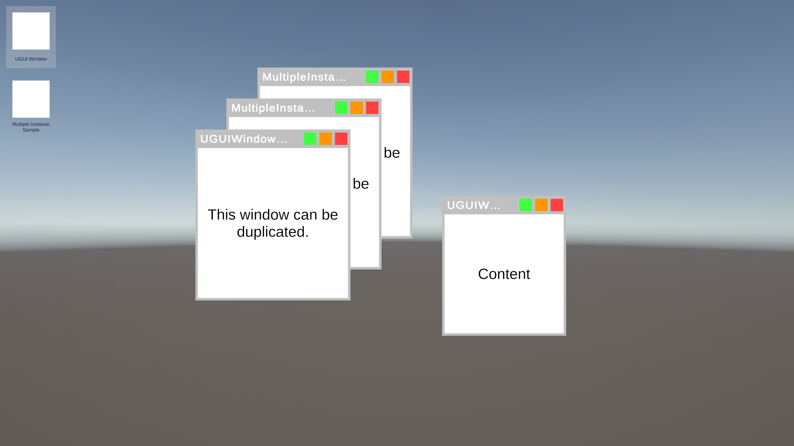

# UGUI-Window-Sample

UGUI를 활용해 창 기반 UI 시스템을 구현하는 프로젝트입니다.

Github Actions를 활용한 CI/CD가 구현되어 있습니다.

## UGUI Window Sample은 다음의 기능을 제공합니다:
- 창 생성
- 창 이동
- 창 크기 조절 (최대화/최소화 포함)
- 창 오브젝트 풀링

## Under Construction
현재 개발 중입니다...