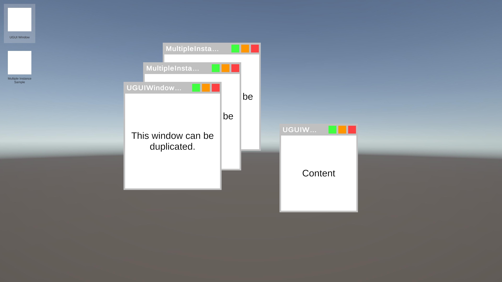

# UGUI-Window-Sample

[](https://github.com/ThunderVolt45/UGUI-Window-Sample/actions/workflows/Unity-Build.yml)
[](LICENSE)




Unity의 **UGUI만으로** 데스크톱 OS 스타일의 창(Window) 기반 UI 시스템을 구현한 프로젝트입니다. 창의 생성·이동·크기 조절·최대화/최소화는 물론, 오브젝트 풀링과 DPI 스케일링까지 갖춘 재사용 가능한 윈도우 프레임워크를 목표로 합니다.

## 주요 기능

- **창 생성** — 타입 한 줄(`CreateWindow<T>()`)로 창 생성, 이름 규약 기반 프리팹 자동 로드
- **창 이동** — 헤더 드래그로 이동 (DPI 보정 적용)
- **창 크기 조절** — 4변(Border)·4모서리(Edge) 드래그 리사이즈, 최소 크기 제한
- **최대화 / 복원 / 최소화** — 버튼·헤더 더블클릭 지원, 직전 상태 기억 후 복원
- **오브젝트 풀링** — 닫은 창을 파괴하지 않고 재사용, 저메모리 시 자동 정리
- **z-순서 관리** — 포커스한 창을 최상단으로(이중 연결 리스트 기반)
- **DPI / 해상도 스케일링** — 캔버스 스케일 일괄 조정, 설정 영구 저장
- **에디터 도구** — 창 템플릿 생성, 기본 컴포넌트 자동 부착/할당
- **CI/CD** — GitHub Actions로 Windows 빌드 및 릴리즈 자동화

## 개발 환경

- **Unity 6000.2.6f2** (Unity 6)
- **Input System** — ESC로 최상단 창 닫기, 마우스 위치 기반 리사이즈 커서
- **TextMeshPro** — 창 타이틀, 설정 UI

## 시작하기

```bash
git clone https://github.com/ThunderVolt45/UGUI-Window-Sample.git
```

Unity 6000.2.6f2(이상)로 프로젝트를 연 뒤, 샘플 씬을 실행하면 데스크톱 데모를 바로 확인할 수 있습니다.

```
Assets/UGUIWindowSample/Scenes/UGUIWindowSampleScene.unity
```

코드에서 창을 띄우는 것은 한 줄이면 됩니다.

```csharp
using UGUIWindow;

// 기본 창 생성
UGUIWindowManager.CreateWindow<UGUIWindow>();

// 위치·크기를 지정해 생성
UGUIWindowManager.CreateWindowEx<UGUIMenu>("메뉴", x: 0, y: 0, width: 300, height: 400);
```

매니저는 씬에 없으면 자동 생성되고, 창 프리팹은 `Resources/Windows/{클래스명}.prefab` 규약으로 로드됩니다. 자세한 설정과 커스텀 창 제작은 아래 문서를 참고하세요.

## 문서

| 문서 | 내용 |
| --- | --- |
| [📖 매뉴얼](docs/Manual.md) | 설치·사용법·설계 설명을 담은 종합 가이드 (8개 챕터) |
| [📐 클래스 다이어그램](docs/ClassDiagram.md) | 클래스 구조 레퍼런스 (Mermaid 다이어그램) |

처음이라면 [매뉴얼 ▸ 01. 시작하기](docs/manual/01-getting-started.md)부터 읽어 보세요.

## 프로젝트 구조

```
Assets/
├── Resources/Windows/              # 창 프리팹 (이름 = 클래스명)
└── UGUIWindowSample/
    ├── Editor/                     # 에디터 확장 (메뉴, 인스펙터 도구)
    ├── Resources/                  # 매니저 / 기본 컴포넌트 프리팹
    ├── Scenes/                     # 샘플 씬
    └── Scripts/
        ├── Base/                   # 핵심 창 시스템 (Window/View/Manager 등)
        ├── Sample/                 # 데스크톱 메타포 데모
        └── Utilities/              # 범용 자료구조
docs/                               # 매뉴얼 & 클래스 다이어그램
```

## CI/CD

`main` 브랜치로의 push 및 pull request 시 [GitHub Actions](.github/workflows/Unity-Build.yml)가 다음을 자동 수행합니다.

1. Windows x64 스탠드얼론 빌드 (`game-ci/unity-builder`)
2. 시맨틱 버전 태그 자동 증가
3. 빌드 결과물(zip)을 첨부한 GitHub Release 생성

## 라이선스

이 프로젝트는 [MIT License](LICENSE)로 배포됩니다. © 2025 ThunderVolt45
</content>
