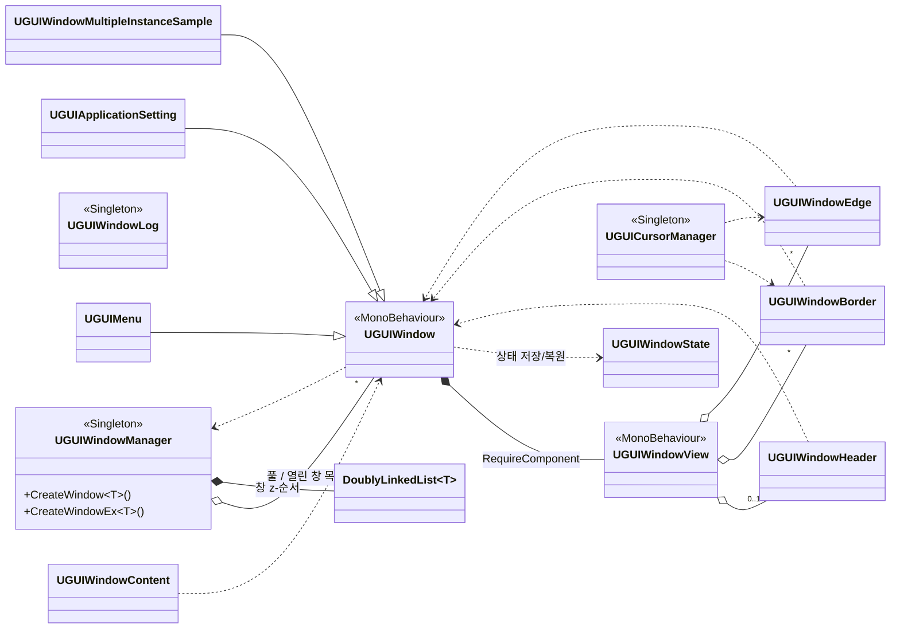

# UGUI Window Sample — 클래스 다이어그램

이 문서는 `UGUI-Window-Sample` 프로젝트의 클래스 구조를 정리한 인덱스입니다. 상세 다이어그램은 클래스(그룹)별 문서로 분리되어 있으며, 모든 다이어그램은 [Mermaid](https://mermaid.js.org/) 기반으로 GitHub에서 바로 렌더링됩니다.

## 레이어 구성

| 레이어 | 위치 | 역할 |
| --- | --- | --- |
| **Base** | `Assets/UGUIWindowSample/Scripts/Base/` | 창 시스템의 핵심. 창의 생성·관리·상호작용을 담당합니다. |
| **Utilities** | `Assets/UGUIWindowSample/Scripts/Utilities/` | 범용 자료구조 등 보조 코드. |
| **Sample** | `Assets/UGUIWindowSample/Scripts/Sample/` | 데스크톱 메타포 데모. Base 레이어의 사용 예시입니다. |
| **Editor** | `Assets/UGUIWindowSample/Editor/` | 에디터 확장(컴포넌트 자동 할당, 메뉴 등). |

## 문서 목록

| 문서 | 다루는 클래스 |
| --- | --- |
| [UGUIWindow](class-diagram/UGUIWindow.md) | `UGUIWindow` · `UGUIWindowView` · `UGUIWindowState` |
| [UGUIWindowManager](class-diagram/UGUIWindowManager.md) | `UGUIWindowManager` |
| [상호작용 컴포넌트](class-diagram/InteractionComponents.md) | `UGUIWindowHeader` · `UGUIWindowBorder` · `UGUIWindowEdge` · `UGUIWindowContent` |
| [UGUICursorManager](class-diagram/UGUICursorManager.md) | `UGUICursorManager` |
| [UGUIWindowLog](class-diagram/UGUIWindowLog.md) | `UGUIWindowLog` |
| [DoublyLinkedList](class-diagram/DoublyLinkedList.md) | `DoublyLinkedList<T>` · `Node<T>` |
| [Sample](class-diagram/Sample.md) | `UGUIDesktop` · `UGUIIcon` · `UGUIMenu` · `UGUIApplicationSetting` 등 |
| [Editor](class-diagram/Editor.md) | `UGUIWindowViewEditor` · `UGUIWindowHelper` · `UGUIEditorMenu` |

## 표기 규약

- `+` public · `-` private · `#` protected · `$` static
- `..|>` 인터페이스 구현 · `--|>` 상속 · `*--` 합성(소유) · `o--` 집합(참조) · `..>` 의존
- 가독성을 위해 Unity 콜백(`Awake`/`Start` 등)과 일부 내부 헬퍼는 생략하거나 요약했습니다.

## 전체 구조 개요

레이어 간 핵심 관계만 추린 상위 수준 다이어그램입니다. 상세 멤버는 각 문서를 참고하세요.

## 부록 — 열거형(enum) 요약

| 열거형 | 정의 위치 | 값 |
| --- | --- | --- |
| `UGUIWindowMode` | `UGUIWindow.cs` | `Windowed`, `Maximized`, `Minimized` |
| `UGUIBorderPosition` | `UGUIWindowBorder.cs` | `North`, `South`, `East`, `West` |
| `UGUIEdgePosition` | `UGUIWindowEdge.cs` | `NorthEast`, `NorthWest`, `SouthEast`, `SouthWest` |
| `UGUICursor` | `UGUICursorManager.cs` | `Default`, `ResizeHorizontal`, `ResizeVetical`, `ResizeDiagonalNeSw`, `ResizeDiagonalNwSe` |
| `UGUIWindowLogLevel` | `UGUIWindowLogLevel.cs` | `Info`, `Warning`, `Error`, `None` |
</content>
