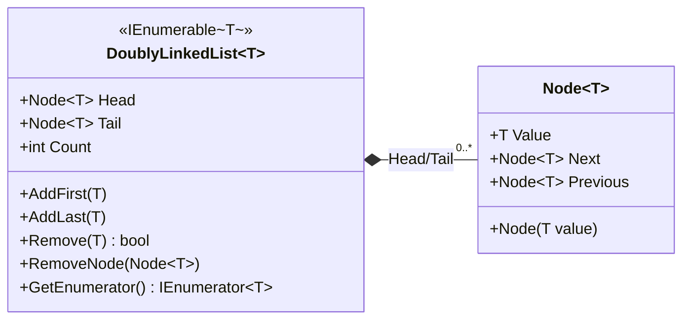

# DoublyLinkedList&lt;T&gt; · Node&lt;T&gt;

> 위치: `Assets/UGUIWindowSample/Scripts/Utilities/DoublyLinkedList.cs`
> [← 클래스 다이어그램 인덱스로](../ClassDiagram.md)

범용 제네릭 이중 연결 리스트입니다. (전역 네임스페이스에 정의) `UGUIWindowManager`가 열린 창의 **z-순서**를 추적하는 데 사용합니다.

## 동작 메모

- `Head`/`Tail` 양쪽 포인터를 유지하므로 `AddLast`/`RemoveNode`가 O(1)입니다.
- `Remove(T value)`는 값으로 노드를 선형 탐색(O(n))한 뒤 `RemoveNode`로 연결을 끊습니다.
- `IEnumerable<T>` 구현으로 `foreach` 순회를 지원합니다 — 매니저가 창 목록을 순회/말단 접근하는 데 활용합니다.
- `#nullable enable`로 노드 포인터의 null 허용 여부를 명시합니다.

## 관련 문서

- [UGUIWindowManager](UGUIWindowManager.md) — 이 자료구조의 사용처
</content>
