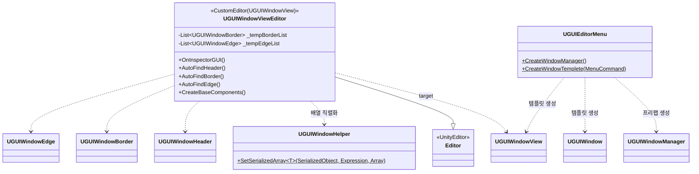

# Editor — 에디터 확장

> 위치: `Assets/UGUIWindowSample/Editor/`
> [← 클래스 다이어그램 인덱스로](../ClassDiagram.md)

플레이 모드가 아닌 **에디터**에서 컴포넌트 자동 할당/생성과 메뉴 항목을 제공합니다.

## 동작 메모

- **`UGUIWindowViewEditor`** — `UGUIWindowView` 인스펙터에 버튼 두 개를 추가합니다.
  - *Auto find Base Components* — 하위 트랜스폼을 재귀 순회해 Header/Border/Edge를 찾아 인스펙터에 할당.
  - *Create & Assignment Base Components* — `Resources/BaseComponents/`의 프리팹을 인스턴스화한 뒤 자동 할당.
- **`UGUIWindowHelper`** — `SerializedProperty` 배열을 안전하게 채우는 제네릭 헬퍼. 프리팹 변경분이 저장되도록 처리합니다. (전역 네임스페이스)
- **`UGUIEditorMenu`** — `GameObject/UGUI Window/...` 메뉴 제공.
  - *Create Window Manager* — 씬에 매니저가 없을 때 `Resources/UGUIWindowManager.prefab`을 생성.
  - *Create Window Templete* — `UGUIWindowView` + `UGUIWindow`를 가진 빈 창 템플릿 생성.

## 관련 문서

- [UGUIWindow](UGUIWindow.md) — 에디터가 다루는 뷰/창
- [상호작용 컴포넌트](InteractionComponents.md) — 자동 탐색 대상
</content>
