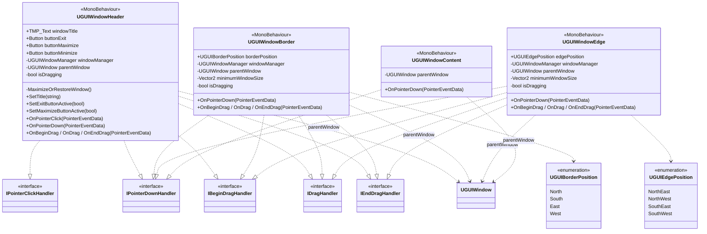

# 상호작용 컴포넌트 (Header / Border / Edge / Content)

> 위치: `Assets/UGUIWindowSample/Scripts/Base/`
> [← 클래스 다이어그램 인덱스로](../ClassDiagram.md)

창의 자식 오브젝트에 부착되어 포인터 이벤트를 받아 창을 **이동·리사이즈·포커스**시키는 컴포넌트들입니다. 모두 `parentWindow`(`UGUIWindow`)를 참조하며, Unity의 드래그/포인터 인터페이스를 구현합니다.

## 컴포넌트별 메모

- **`UGUIWindowHeader`** — 타이틀과 종료/최대화/최소화 버튼을 보유. 드래그로 창을 이동시키고, 더블클릭(`OnPointerClick`, `clickCount == 2`)으로 최대화↔복원합니다. 드래그 델타에 `ScreenMultiplier`를 곱해 DPI 보정합니다.
- **`UGUIWindowBorder`** — 4방향(`borderPosition`) 변을 드래그해 한 축 크기를 조절. `minimumWindowSize` 미만으로 줄어들지 않도록 제한합니다.
- **`UGUIWindowEdge`** — 4모서리(`edgePosition`)를 드래그해 두 축을 동시에 조절. 로직은 Border와 동일한 패턴입니다.
- **`UGUIWindowContent`** — 본문 클릭 시 `parentWindow.Focus()`만 호출하는 최소 컴포넌트.
- 드래그 종료(`OnEndDrag`) 시 모두 `parentWindow.MemorizeLastWindowState()`로 상태를 기록합니다.

## 관련 문서

- [UGUIWindow](UGUIWindow.md) — 이 컴포넌트들이 참조하는 부모 창
- [UGUICursorManager](UGUICursorManager.md) — Border/Edge 위에서 리사이즈 커서를 전환
</content>
