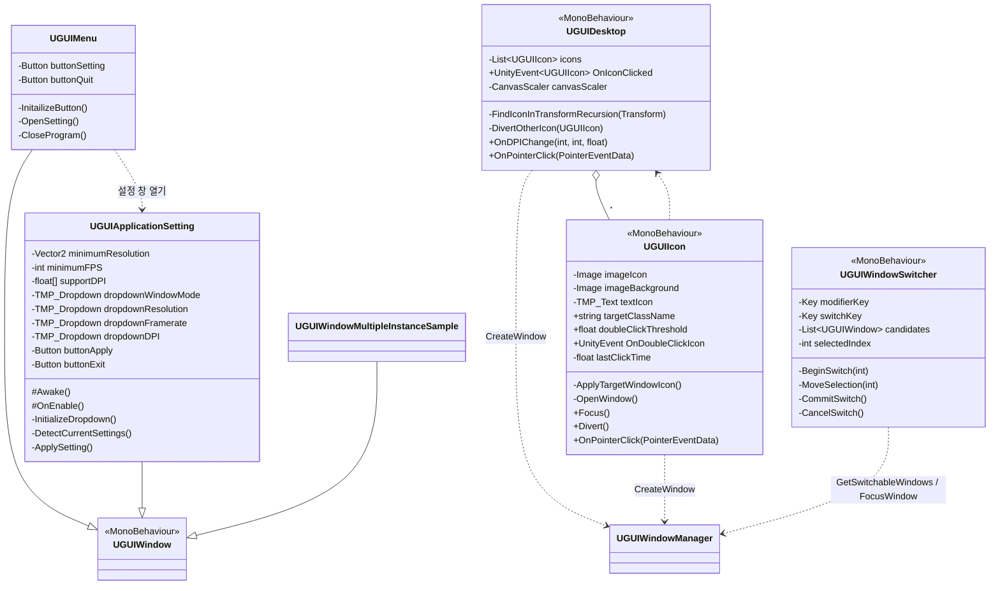

# Sample — 데스크톱 메타포 데모

> 위치: `Assets/UGUIWindowSample/Scripts/Sample/`
> [← 클래스 다이어그램 인덱스로](../ClassDiagram.md)

Base 레이어의 사용 예시입니다. `UGUIWindow`를 상속한 구체 창들과, 데스크톱/아이콘 UI로 구성됩니다.

## 흐름 메모

- **`UGUIDesktop`** — 시작 시 데모 창들을 생성하고, 하위 트랜스폼을 재귀 순회해 `UGUIIcon`을 수집합니다. 아이콘 클릭 포커스를 상호 배타적으로 관리합니다.
- **`UGUIIcon`** — `targetClassName`에 맞는 창 프리팹의 `WindowIcon`을 바탕화면 아이콘에 반영합니다. 더블클릭 시 `Type.GetType`을 수행해 `UGUIWindowManager.CreateWindow(type)`을 호출합니다. 더블클릭은 `doubleClickThreshold` 내 연속 클릭으로 판정합니다.
- **`UGUIMenu`** — 설정 버튼으로 `UGUIApplicationSetting` 창을 열고 자신을 닫으며, 종료 버튼으로 애플리케이션을 종료합니다.
- **`UGUIApplicationSetting`** — 해상도/프레임레이트/윈도우 모드/DPI 드롭다운을 구성하고, `ApplySetting`에서 `Screen.SetResolution`과 `UGUIWindowManager.SetDPI`를 적용합니다. `Awake`/`OnEnable`을 `override`하여 부모 초기화 후 추가 로직을 실행합니다.
- **`UGUIWindowMultipleInstanceSample`** — 다중 인스턴스/풀링 동작 확인용 빈 창.
- **`UGUIWindowSwitcher`** — `UGUIWindowManager`가 `Resources/Sample/UGUIWindowSwitcher.prefab`에서 로드해 `MainCanvas` 최상단에 부착하는 프리팹 기반 오버레이입니다. `Ctrl + Backquote`를 Alt+Tab 대체 입력으로 사용하며, 프리팹이 없으면 코드로 대체 생성하지 않습니다. 후보는 `UGUIWindowManager.GetSwitchableWindows`에서 받아오며, 확정 시 `FocusWindow`로 최소화 복원과 포커스를 처리합니다.

## 관련 문서

- [UGUIWindow](UGUIWindow.md) — 상속 기반 클래스
- [UGUIWindowManager](UGUIWindowManager.md) — 창 생성 API 제공
</content>
