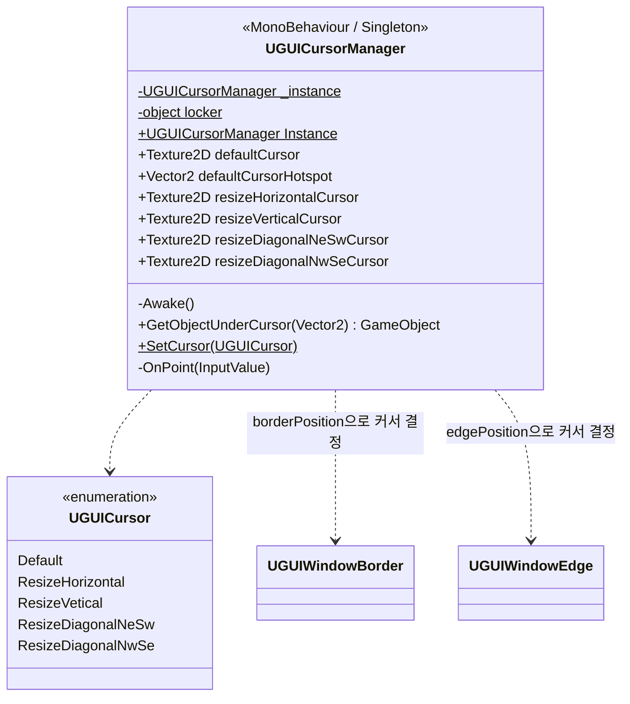

# UGUICursorManager

> 위치: `Assets/UGUIWindowSample/Scripts/Base/UGUICursorManager.cs`
> [← 클래스 다이어그램 인덱스로](../ClassDiagram.md)

마우스 커서 아래의 UI 오브젝트를 레이캐스트로 판별해, Border/Edge 위에서는 **리사이즈 커서**로 전환하는 싱글톤입니다.

## 동작 메모

- 인스턴스가 없으면 `Resources/UGUIWindowManager` 프리팹에서 함께 로드됩니다(매니저 프리팹에 동거).
- `OnPoint`(Input System 콜백)에서 `GetObjectUnderCursor`로 커서 아래 오브젝트를 찾고,
  - `UGUIWindowBorder` → East/West는 수평, North/South는 수직 커서
  - `UGUIWindowEdge` → NE/SW는 ↘↖, NW/SE는 ↗↙ 대각선 커서
  - 그 외에는 기본 커서로 복귀합니다.
- `GetObjectUnderCursor`는 `EventSystem.RaycastAll` 결과 중 최상단 오브젝트를 반환합니다.

## 관련 문서

- [상호작용 컴포넌트](InteractionComponents.md) — 커서 판별 대상인 Border/Edge
</content>
