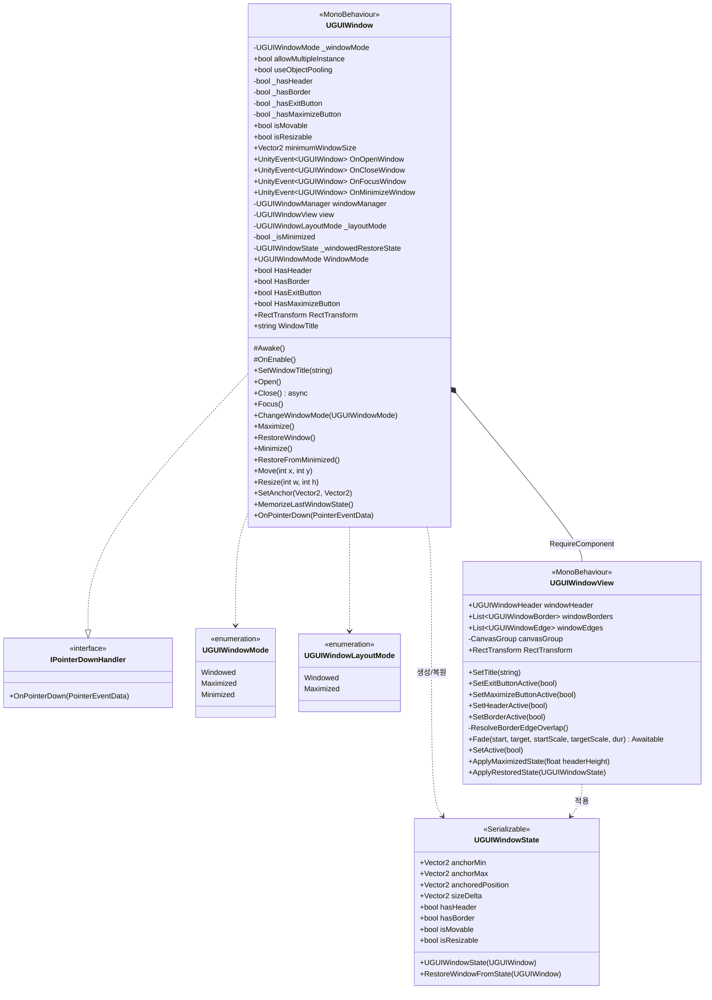

# UGUIWindow · UGUIWindowView · UGUIWindowState

> 위치: `Assets/UGUIWindowSample/Scripts/Base/`
> [← 클래스 다이어그램 인덱스로](../ClassDiagram.md)

창 한 개를 이루는 핵심 삼각 구조입니다.

- **`UGUIWindow`** — 창의 컨트롤러. 모드 전환·열기/닫기·이동/리사이즈 등 동작과 상태를 관리합니다.
- **`UGUIWindowView`** — 창의 뷰. 헤더·보더·엣지의 활성화, Fade 애니메이션, 레이아웃 적용을 담당합니다.
- **`UGUIWindowState`** — 위치·크기·플래그를 담는 직렬화 가능한 스냅샷. 최대화↔복원 시 사용됩니다.

## 동작 메모

- `UGUIWindow`는 `[RequireComponent(typeof(UGUIWindowView))]`로 뷰를 강제 보유하며, 모든 시각/레이아웃 변경을 `view`에 위임합니다.
- 모드 변경(`WindowMode` 프로퍼티)은 `ChangeWindowMode`를 통해 `Maximize`/`RestoreWindow`/`Minimize`로 분기됩니다.
- 기본 창 레이아웃은 `_windowedRestoreState`(`UGUIWindowState`)에 저장되고, `RestoreWindow`에서 `ApplyRestoredState`로 복원됩니다.
- `_layoutMode`는 `Windowed`/`Maximized`를, `_isMinimized`는 최소화 여부를 독립적으로 관리합니다. `WindowMode`는 두 값을 기존 public enum으로 합쳐 반환합니다.
- 이동/리사이즈/앵커 변경(`Move`/`Resize`/`SetAnchor`)은 모두 `MemorizeLastWindowState`로 마지막 상태를 갱신합니다.
- `Close`는 `Fade` 애니메이션을 `await`한 뒤 비활성화하며, 풀링 미사용/다중 인스턴스 창이면 `Destroy`합니다.

## 관련 문서

- [UGUIWindowManager](UGUIWindowManager.md) — 이 창을 생성·풀링·관리하는 매니저
- [상호작용 컴포넌트](InteractionComponents.md) — 뷰가 보유하는 Header/Border/Edge
</content>
