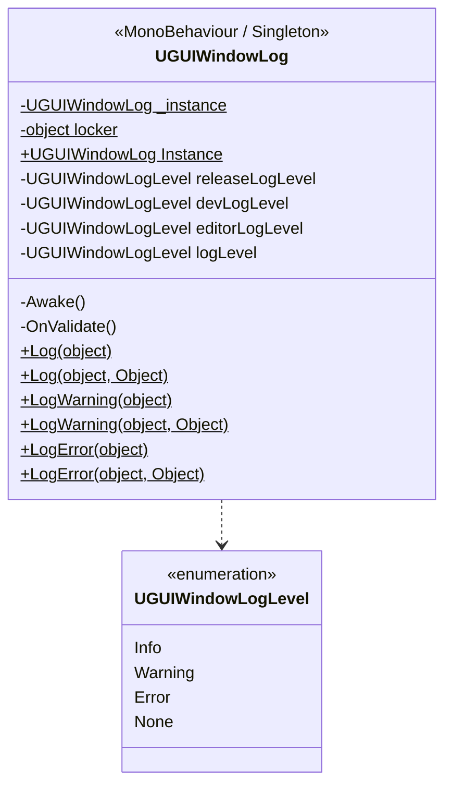

# UGUIWindowLog

> 위치: `Assets/UGUIWindowSample/Scripts/Base/UGUIWindowLog.cs`, `UGUIWindowLogLevel.cs`
> [← 클래스 다이어그램 인덱스로](../ClassDiagram.md)

빌드 종류(에디터 / 개발 빌드 / 릴리즈)에 따라 로그 레벨을 분리 적용하는 로깅 싱글톤입니다.

## 동작 메모

- 인스턴스가 없으면 `UGUIWindowLogger`라는 빈 `GameObject`를 만들어 컴포넌트를 부착합니다.
- 컴파일 심볼에 따라 활성 `logLevel`이 결정됩니다.
  - `UNITY_EDITOR` → `editorLogLevel` (기본 `Info`)
  - `DEVELOPMENT_BUILD` → `devLogLevel` (기본 `Warning`)
  - 그 외 릴리즈 → `releaseLogLevel` (기본 `Error`)
- 각 `Log*` 정적 메서드는 현재 `logLevel`보다 낮은 심각도의 메시지를 무시합니다.

## 관련 문서

- [클래스 다이어그램 인덱스](../ClassDiagram.md)
</content>
