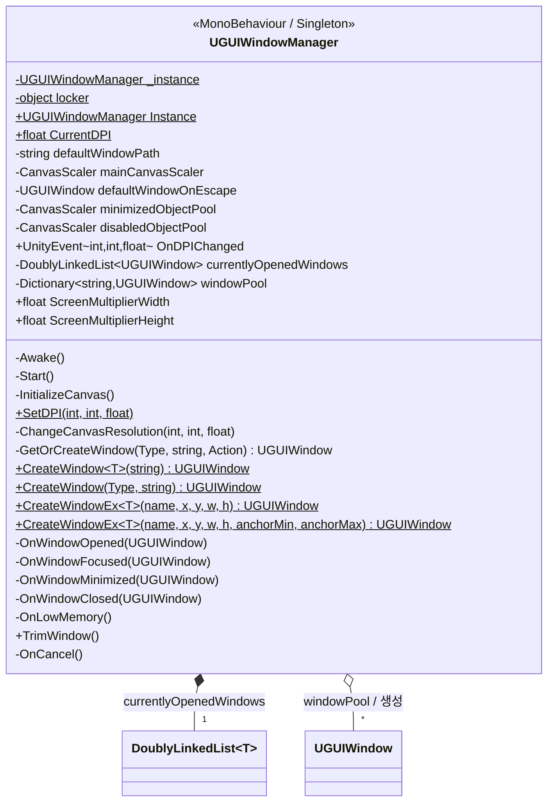

# UGUIWindowManager

> 위치: `Assets/UGUIWindowSample/Scripts/Base/UGUIWindowManager.cs`
> [← 클래스 다이어그램 인덱스로](../ClassDiagram.md)

창의 **생성·오브젝트 풀링·z-순서·DPI**를 총괄하는 스레드 세이프 싱글톤입니다. 창 시스템의 단일 진입점 역할을 합니다.

## 동작 메모

- **싱글톤**: `Instance`는 Double-checked locking 기반. 씬에 인스턴스가 없으면 `Resources/UGUIWindowManager` 프리팹을 로드해 생성하고 `DontDestroyOnLoad`로 유지합니다.
- **생성 단일 진입점**: 모든 `CreateWindow*` 정적 메서드는 내부적으로 `GetOrCreateWindow`를 호출합니다. 풀에 있으면 재사용, 없으면 `Resources/Windows/{TypeName}` 프리팹을 인스턴스화합니다.
- **z-순서 관리**: 열린 창은 `currentlyOpenedWindows`(이중 연결 리스트)로 추적합니다. 포커스/열기 시 리스트 말단으로 이동시키고 `SetAsLastSibling`으로 최상단에 그립니다.
- **오브젝트 풀**: 닫힌 창은 `disabledObjectPool`, 최소화된 창은 `minimizedObjectPool`로 부모를 옮겨 보관합니다. `allowMultipleInstance` 창은 풀링하지 않습니다.
- **DPI / 메모리**: `SetDPI`는 CanvasScaler 해상도를 조정하고 `PlayerPrefs`에 저장합니다. `Application.lowMemory` 시 `TrimWindow`로 미사용 창을 파괴합니다.
- **입력**: `OnCancel`(ESC)은 열린 창이 있으면 최상단 창을 닫고, 없으면 `defaultWindowOnEscape`를 생성합니다.

## 관련 문서

- [UGUIWindow](UGUIWindow.md) — 매니저가 생성/관리하는 창
- [DoublyLinkedList](DoublyLinkedList.md) — 열린 창 z-순서 추적 자료구조
</content>
