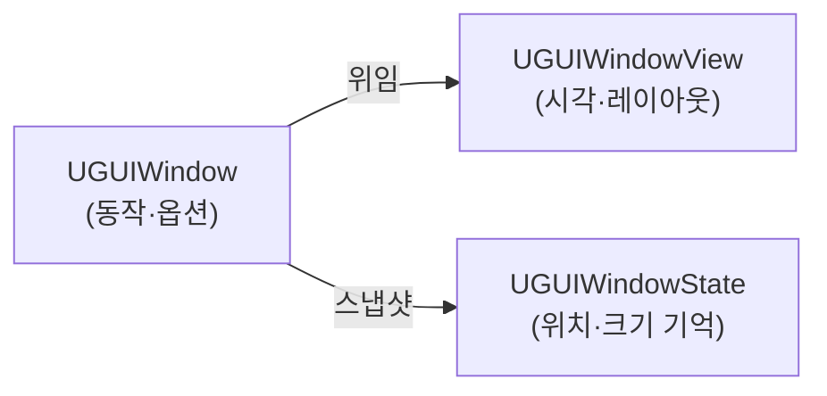
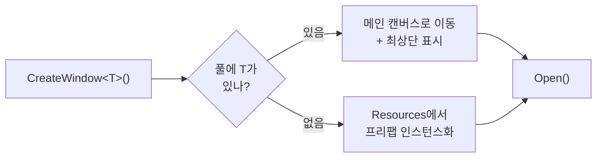

# 02. 핵심 개념과 아키텍처

> [← 매뉴얼 목차로](../Manual.md)

이 장은 시스템이 *왜 이렇게 나뉘어 있는지*를 설명합니다. 사용법보다 설계 의도에 초점을 둡니다.

**목차**

- [창 한 개의 3분할: Controller / View / State](#창-한-개의-3분할-controller--view--state)
- [본문 Content와 스크롤](#본문-content와-스크롤)
- [중앙 관리자: UGUIWindowManager](#중앙-관리자-uguiwindowmanager)
- [오브젝트 풀링](#오브젝트-풀링)
- [z-순서: 이중 연결 리스트](#z-순서-이중-연결-리스트)
- [DPI / 해상도 스케일링](#dpi--해상도-스케일링)
- [로깅](#로깅)

---

## 창 한 개의 3분할: Controller / View / State

창 하나는 세 역할로 분리되어 있습니다.

| 역할 | 클래스 | 책임 |
| --- | --- | --- |
| **Controller** | `UGUIWindow` | 모드 전환, 열기/닫기, 이동/리사이즈 등 *동작*과 옵션을 보유 |
| **View** | `UGUIWindowView` | 헤더·보더·엣지 활성화, Fade 애니메이션, 레이아웃 *적용* |
| **State** | `UGUIWindowState` | 기본 창의 위치·크기·플래그 *스냅샷* (최대화↔복원에 사용) |

`UGUIWindow`는 `[RequireComponent(typeof(UGUIWindowView))]`로 View를 강제 보유하며, 모든 시각/레이아웃 변경을 View에 위임합니다.



> **왜 나눴나?** 동작 로직(언제 최대화할지)과 렌더링 로직(어떻게 보일지)을 분리하면, 창의 외형을 바꿔도 컨트롤러를 건드리지 않아도 됩니다. 상태를 별도 객체(`UGUIWindowState`)로 떼어 둔 덕분에 기본 창 레이아웃을 저장했다가 최대화 해제 시 복원하는 일이 단순해집니다. 최소화 여부는 레이아웃 모드(`Windowed`/`Maximized`)와 별도로 관리하므로 최대화된 창을 최소화해도 원래 레이아웃 모드를 잃지 않습니다.

상세 멤버는 [클래스 다이어그램: UGUIWindow](../class-diagram/UGUIWindow.md) 참고.

## 본문 Content와 스크롤

창의 본문 UI는 `Content/Viewport/ScrollContent` 아래에 배치합니다.

```text
UGUIWindow
└─ Content
   ├─ Viewport
   │  └─ ScrollContent
   ├─ VerticalScrollbar
   └─ HorizontalScrollbar
```

`Content`에는 `UGUIWindowContent`가 붙어 있으며, 이 컴포넌트가 `ScrollRect`, `RectMask2D`, 스크롤바 표시 상태를 관리합니다. 기본값은 **세로 스크롤만 사용**이며, 가로 스크롤은 필요한 창에서 `enableHorizontalScroll`을 켜서 사용합니다.

스크롤바는 창 크기가 내용의 선호 크기보다 작아지는 즉시 나타나지 않습니다. 먼저 `ScrollContent`가 `Viewport` 안에서 줄어들고, `LayoutUtility.GetMinWidth/Height`와 `minimumContentSize`로 계산한 최소 요구 크기보다 `Viewport`가 작아지는 축에서만 스크롤바가 표시됩니다. 따라서 최소 크기 기준이 필요한 UI는 `LayoutElement` 또는 LayoutGroup 계열 컴포넌트로 min 값을 표현하세요.

## 중앙 관리자: UGUIWindowManager

개별 창은 자기 자신만 알 뿐, "지금 어떤 창들이 열려 있고 누가 맨 앞인지"는 모릅니다. 그 전역 상태를 `UGUIWindowManager`가 싱글톤으로 관리합니다.

매니저가 책임지는 것:

- **창 생성** — `CreateWindow*` 팩토리 (단일 진입점은 내부 `GetOrCreateWindow`)
- **오브젝트 풀링** — 닫은 창을 파괴하지 않고 재사용
- **z-순서(겹침 순서)** — 어떤 창이 맨 앞인지 추적
- **창 전환용 조회** — 메인 캔버스/최소화 풀의 활성 창과 최근 포커스 순서 제공
- **DPI / 해상도** — 캔버스 스케일 일괄 조정
- **입력** — ESC로 최상단 창 닫기

상세는 [클래스 다이어그램: UGUIWindowManager](../class-diagram/UGUIWindowManager.md) 참고.

### 싱글톤 패턴

`Instance` 접근자는 **Double-checked locking**으로 구현되어 멀티스레드 환경에서도 인스턴스가 중복 생성되지 않습니다. 씬에 인스턴스가 없으면 `Resources/UGUIWindowManager` 프리팹을 로드해 만들고 `DontDestroyOnLoad`로 씬 전환에도 유지합니다. (`UGUICursorManager`, `UGUIWindowLog`도 동일한 패턴)

## 오브젝트 풀링

창은 닫는다고 파괴되지 않습니다. 기본적으로 비활성 풀(`disabledObjectPool`)로 부모를 옮겨 **보관**해 두었다가, 다음에 같은 타입을 요청하면 재사용합니다.



- **키는 타입 이름**입니다(`windowType.Name`). 따라서 풀링을 쓰는 한 한 타입당 인스턴스는 하나입니다.
- `allowMultipleInstance = true`면 풀링을 끄고 매번 새로 생성합니다(같은 창을 여러 개 띄우는 용도).
- `Application.lowMemory` 시 `TrimWindow()`가 비활성 창을 실제로 파괴해 메모리를 회수합니다.

> **왜 풀링인가?** 창은 생성 비용(프리팹 인스턴스화, 레이아웃 계산)이 큽니다. 열고 닫기를 반복하는 OS형 UI에서 매번 파괴/생성하면 GC 부담과 끊김이 생기므로, 재사용으로 이를 줄입니다. 자세한 동작은 [06. 이벤트와 라이프사이클](06-events-lifecycle.md) 참고.

## z-순서: 이중 연결 리스트

열린 창의 앞뒤 순서는 `DoublyLinkedList<UGUIWindow>`(`currentlyOpenedWindows`)로 관리합니다.

- 창을 열거나 포커스하면 → 리스트 **말단**으로 이동시키고 `transform.SetAsLastSibling()`으로 최상단에 그립니다.
- 최소화/닫기를 하면 → 리스트에서 제거합니다.
- ESC(`OnCancel`)는 리스트 **말단(=최상단)** 창을 닫습니다.

창 전환 UI는 최소화된 창도 후보에 넣어야 하므로 z-순서 리스트만 사용하지 않습니다. `GetOpenWindows()`는 `MainCanvas` 바로 아래 활성 창을 다시 찾고, `GetVisibleWindows()`/`GetSwitchableWindows()`는 `MainCanvas`와 최소화 풀의 활성 창을 함께 조회합니다. 최근 포커스 순서만 별도 목록으로 유지하고, 실제 후보 목록은 API 호출 시 계층에서 다시 수집해 닫힌 창·비활성 창·시스템 UI가 섞이지 않게 합니다.

> **왜 List가 아니라 이중 연결 리스트인가?** z-순서 변경은 "임의 위치의 창을 빼서 맨 뒤로 보내는" 연산이 잦습니다. 이중 연결 리스트는 노드 참조만 있으면 제거/말단 추가가 O(1)이라 이 패턴에 적합합니다. 구현은 [클래스 다이어그램: DoublyLinkedList](../class-diagram/DoublyLinkedList.md) 참고.

## DPI / 해상도 스케일링

매니저는 화면 해상도와 DPI 설정에 맞춰 모든 캔버스의 `CanvasScaler.referenceResolution`을 일괄 조정합니다.

- `SetDPI(screenWidth, screenHeight, dpi)` → `referenceResolution = 화면크기 / dpi`
- 설정값은 `PlayerPrefs`("DPI Settings")에 저장되어 다음 실행에도 유지됩니다(기본 `2f` = 200%).
- 변경 시 `OnDPIChanged` 이벤트가 발생해, 데스크톱 같은 외부 캔버스도 함께 스케일을 맞출 수 있습니다.

드래그 이동/리사이즈가 DPI와 무관하게 일관된 속도로 동작하도록, 헤더·보더·엣지는 포인터의 이전/현재 screen point를 창 부모 `RectTransform`의 로컬 좌표로 변환한 차이를 사용합니다. 이 방식은 DPI뿐 아니라 에디터 Game 뷰 Scale, WebGL 캔버스 스케일처럼 화면 픽셀과 캔버스 좌표가 달라지는 환경도 함께 처리합니다. 변환에 실패하는 드문 경우에는 매니저의 `ScreenMultiplierWidth/Height`(= referenceResolution / screen)를 곱한 기존 보정값으로 되돌아갑니다.

## 로깅

`UGUIWindowLog`는 빌드 종류에 따라 로그 레벨을 분리합니다(에디터=Info, 개발 빌드=Warning, 릴리즈=Error). 시스템 내부 메시지는 `Debug.Log` 대신 이 래퍼를 통해 출력합니다. 상세는 [클래스 다이어그램: UGUIWindowLog](../class-diagram/UGUIWindowLog.md) 참고.

## 다음으로

- 실제로 창을 만들어 보려면 → [03. 창 만들기](03-creating-windows.md)
</content>
